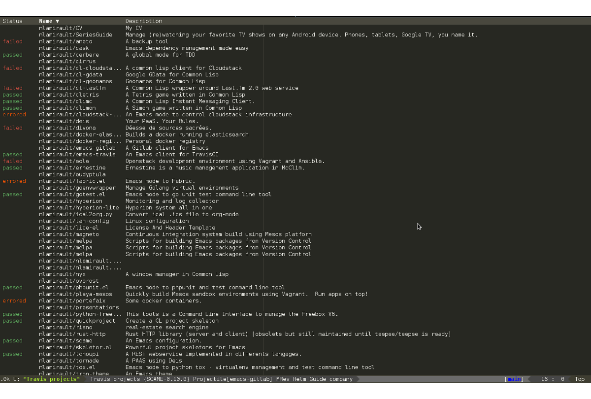

# emacs-travis

[![travis][badge-travis]][travis]
[![drone][badge-drone]][drone]
[![wercker][badge-wercker]][wercker]

`emacs-travis` provides :
* a REST client to the [Travis][] API
* a [Helm][] interface

## Installation

The recommended way to install ``emacs-travis`` is via [MELPA][]:

    M-x package-install emacs-travis

or [Cask][]:

	(depends-on "travis")

## Usage

* Setup your Travis configurations using your Github token :

        $ export TRAVIS_TOKEN=xxxxxx

* Display your Travis build status for some projects:

        M-x travis-show-projects

See 

## Development

### Cask

``emacs-travis`` use [Cask][] for dependencies
management. Install it and retrieve dependencies :

    $ curl -fsSkL https://raw.github.com/cask/cask/master/go | python
    $ export PATH="$HOME/.cask/bin:$PATH"
    $ cask

### Tests

* Launch unit tests :

        $ export TRAVIS_TOKEN xxxxxx
        $ make clean test

## Support / Contribute

See [here](CONTRIBUTING.md)

## Changelog

A changelog is available [here](ChangeLog.md).

## License

See [LICENSE](LICENSE).

## Contact

Nicolas Lamirault <nicolas.lamirault@gmail.com>

[emacs-travis]: https://github.com/nlamirault/emacs-travis
[badge-license]: https://img.shields.io/badge/license-GPL_2-green.svg?style=flat
[LICENSE]: https://github.com/nlamirault/emacs-travis/blob/master/LICENSE
[travis]: https://travis-ci.org/nlamirault/emacs-travis
[badge-travis]: http://img.shields.io/travis/nlamirault/emacs-travis.svg?style=flat
[badge-drone]: https://drone.io/github.com/nlamirault/emacs-travis/status.png
[drone]: https://drone.io/github.com/nlamirault/emacs-travis/latest
[badge-wercker]: https://app.wercker.com/status/230e39942045191c79677ed663572c69/s
[wercker]: https://app.wercker.com/project/bykey/230e39942045191c79677ed663572c69
[GNU Emacs]: https://www.gnu.org/software/emacs/
[MELPA]: http://melpa.milkbox.net/
[Cask]: http://cask.github.io/
[Issue tracker]: https://github.com/nlamirault/emacs-travis/issues
[Helm]: https://github.com/emacs-helm/helm
